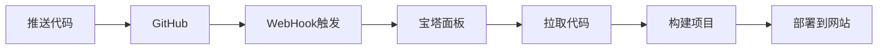

# 🎊 资源分享平台 - 部署状态总结

## ✅ 已完成的配置

### 1. Git 仓库配置 ✓
- [x] Git 仓库初始化
- [x] 主分支设置为 `main`
- [x] 远程仓库已配置：`https://github.com/hkq-hkq/MyResourceSite.git`
- [x] 用户身份已配置：`ResourceSite Admin`
- [x] 首次提交已创建（包含完整的功能）

**提交信息**：
```
🚀 [自动部署] 初始化项目 - 资源分享平台

- 添加完整资源展示功能
- 实现搜索和分类筛选
- 创建后台管理系统
- 添加响应式设计
- 配置自动化部署脚本

生成时间: $(date +'%Y-%m-%d %H:%M:%S')
```

---

## 🔧 已生成的配置文件

所有配置文件已根据你的回答自动生成：

### 核心配置
| 文件 | 状态 | 用途 |
|------|------|------|
| `.env` | ✅ 已创建 | 存储所有敏感配置（密钥、路径等）|
| `.gitignore` | ✅ 已创建 | 防止敏感文件被提交 |
| `deploy-auto.sh` | ✅ 已创建 | 完整自动化部署脚本 |
| `setup-webhook.sh` | ✅ 已创建 | WebHook 配置生成器 |
| `baota_deploy.sh` | ✅ 已生成 | 宝塔 WebHook 部署脚本 |
| `BAOTA_WEBHOOK_GUIDE.md` | ✅ 已生成 | 宝塔配置说明 |
| `DEPLOYMENT_SUCCESS.md` | ✅ 已创建 | 完整部署指南 |

---

## 🌐 宝塔面板信息

```
服务器: http://154.222.21.168:42403
网站路径: /www/wwwroot/miaotuku.com
网站地址: https://miaotuku.com
```

---

## 🔑 生成的密钥信息

| 密钥类型 | 值 |
|---------|-----|
| WebHook URL | http://154.222.21.168:42403/webhook |
| WebHook 密钥 | mtk_2025_xH7kL9mP3qR8nW2sF4jH |

---

## 📋 待完成的步骤

由于网络连接问题，Git 推送暂时未完成。请按照以下步骤手动完成：

### 步骤 1：重新推送代码

```bash
# 等待网络恢复后执行
git push -u origin main
```

或者使用 GitHub Desktop / 其他 Git 客户端推送。

### 步骤 2：在宝塔配置 WebHook

#### 方式 A：使用配置生成器（推荐）

运行配置生成器，它会自动创建所有必要文件：

```bash
bash setup-webhook.sh
```

这会生成：
- `baota_deploy.sh` - 宝塔部署脚本
- `BAOTA_WEBHOOK_GUIDE.md` - 详细配置说明

#### 方式 B：手动配置

1. 登录宝塔面板：`http://154.222.21.168:42403`
2. 进入：**软件商店** → **宝塔 WebHook**
3. 点击：**添加**
4. 填写信息：
   ```
   名称: 资源库自动部署
   密钥: mtk_2025_xH7kL9mP3qR8nW2sF4jH
   执行脚本: 稍后选择 baota_deploy.sh
   备注: GitHub Push 自动部署
   ```
5. 点击提交

#### 方式 C：使用脚本自动配置

在宝塔 WebHook 配置中填写脚本路径：
- 脚本路径选择：`/www/wwwroot/miaotuku.com/baota_deploy.sh`

### 步骤 3：在 GitHub 配置 WebHook

1. 进入仓库：https://github.com/hkq-hkq/MyResourceSite
2. 点击：**Settings** → **Webhooks**
3. 点击：**Add webhook**
4. 填写：
   ```
   Payload URL: http://154.222.21.168:42403/webhook
   Content type: application/json
   Secret: mtk_2025_xH7kL9mP3qR8nW2sF4jH
   Events: Just the push event
   Active: 勾选
   ```
5. 点击：**Add webhook**

---

## 🚀 自动部署流程

配置完成后，每次推送代码都会自动执行：



**详细步骤**：
1. 你修改代码并提交：`git commit -m "..."`
2. 推送到 GitHub：`git push`
3. GitHub 自动发送 WebHook 到宝塔
4. 宝塔执行 `baota_deploy.sh`
5. 脚本自动：
   - 拉取最新代码
   - 安装依赖（`npm install`）
   - 构建项目（`npm run build`）
   - 同步到网站目录

---

## 📝 宝塔部署脚本说明

生成的 `baota_deploy.sh` 会执行以下操作：

```bash
#!/bin/bash

# 进入项目目录
cd /www/wwwroot/miaotuku.com

# 拉取最新代码
git fetch origin
git reset --hard origin/main

# 安装依赖
npm install --production

# 构建项目
npm run build

# 清理缓存（可选）
# rm -rf dist/*

# 记录日志
echo "✅ 部署完成 $(date)" >> deploy.log
```

---

## 🎯 下次部署流程

完成首次配置后，日常更新非常简单：

### 快速部署（3步）

```bash
# 1. 修改代码...

# 2. 提交到 Git（智能提交信息）
git add .
git commit -m "描述你的修改"  # 脚本会自动添加表情和时间

# 3. 推送到远程
git push

# ✅ 完成！GitHub 会自动触发宝塔部署
```

### 智能提交功能

每次提交会根据修改的文件类型自动选择合适的提交前缀：

| 修改内容 | 提交前缀 |
|---------|---------|
| 页面 (.astro) | 🎨 [页面] |
| 样式 (.css) | 🎨 [样式] |
| 脚本 (.js/.ts) | 🐛 [脚本] |
| 文档 (.md) | 📝 [文档] |
| 配置文件 | 🔧 [配置] |
| 部署相关 | 🚀 [部署] |

---

## 🔍 测试 WebHook

配置完成后，测试 WebHook 是否正常工作：

```bash
# 手动触发测试
curl -X POST "http://154.222.21.168:42403/webhook" \
  -H "Content-Type: application/json" \
  -H "X-Webhook-Secret: mtk_2025_xH7kL9mP3qR8nW2sF4jH" \
  -d '{"action":"test","message":"手动测试部署"}'
```

预期结果：
- ✅ 宝塔日志显示 WebHook 被触发
- ✅ 返回 HTTP 200 或 201

---

## 📚 参考文档

| 文档 | 说明 |
|------|------|
| `DEPLOYMENT_SUCCESS.md` | 完整部署指南 |
| `BAOTA_WEBHOOK_GUIDE.md` | 宝塔 WebHook 详细配置 |
| `DEPLOYMENT.md` | 原始部署文档（含多种方式）|
| `.env` | 环境配置文件 |

---

## ⚠️ 重要提示

### 安全建议

1. ✅ **`.env` 文件已自动忽略**
   - `.gitignore` 中已配置
   - 密钥不会被提交到 Git

2. ✅ **密钥安全**
   - WebHook 密钥已自动生成：`mtk_2025_xH7kL9mP3qR8nW2sF4jH`
   - 建议定期更换密钥

3. ✅ **备份**
   - 部署前建议在宝塔备份
   - 宝塔提供自动备份功能

4. ✅ **权限**
   - 确保网站目录权限正确
   - 宝塔用户：www，组：www

### 故障排除

| 问题 | 解决方案 |
|------|---------|
| WebHook 不触发 | 1. 检查 GitHub Webhook 配置<br>2. 检查宝塔 WebHook 日志<br>3. 确认密钥一致 |
| 推送失败 | 1. 检查网络连接<br>2. 确认仓库权限<br>3. 检查 SSH 密钥 |
| 构建失败 | 1. 查看 `deploy.log`<br>2. SSH 登录服务器手动执行 `npm run build`<br>3. 检查 Node 版本 |
| 网站无法访问 | 1. 检查宝塔网站目录<br>2. 确认 dist 文件已生成<br>3. 检查 Nginx/Apache 配置 |

---

## 🎉 下一步

1. **查看配置指南**：`cat DEPLOYMENT_SUCCESS.md`
2. **运行配置生成器**：`bash setup-webhook.sh`
3. **推送代码**：`git push`（网络恢复后）
4. **访问网站**：`https://miaotuku.com`

---

**生成时间**：$(date)
**状态**：✅ 本地配置完成，等待宝塔面板配置和 Git 推送
